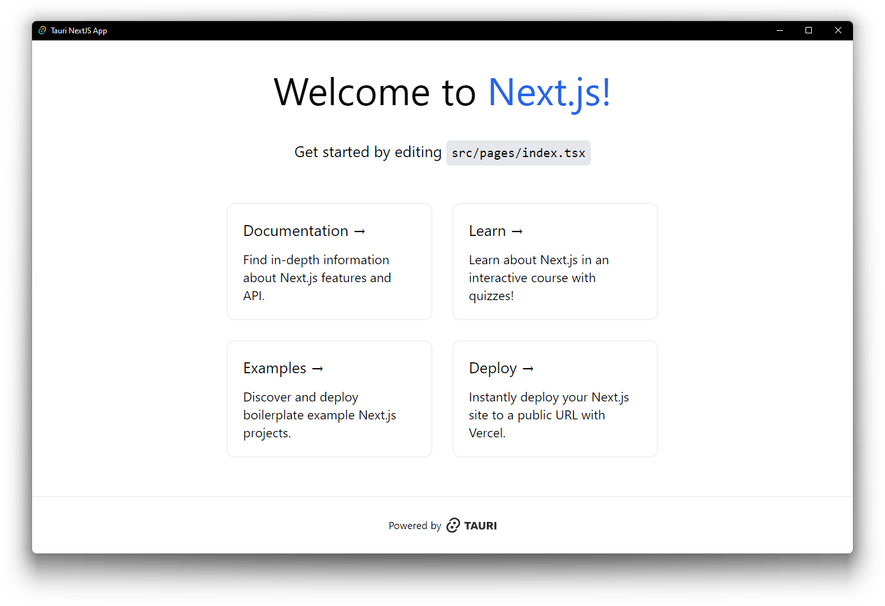

# Tauri + Next.js Template



This is a [Tauri](https://tauri.app/) project template using [Next.js](https://nextjs.org/),
bootstrapped by combining [`create-next-app`](https://github.com/vercel/next.js/tree/canary/packages/create-next-app)
and [`create tauri-app`](https://tauri.app/v1/guides/getting-started/setup).

This template uses [`yarn`](https://classic.yarnpkg.com/) as the Node.js dependency
manager.

## Getting Started

### Running Next.js (browser) development server:

To run a normal browser-based development server for the Next.js frontend:

```shell
yarn dev
```

This will start a local Next.js development server on `localhost:3000`

### Running development server using Tauri window:

To develop and run the frontend on a Tauri window:

```shell
yarn tauri dev
```

This will load the Next.js frontend directly in a Tauri webview window.

### Source structure

Next.js frontend source files are located in `src/` and Tauri Rust application source
files are located in `src-tauri/`. Please consult the Next.js and Tauri documentation
respectively for questions pertaining to either technology.

## Caveats

### Static Site Generation / Pre-rendering

Next.js is a great React frontend framework which supports server-side rendering (SSR)
as well as static site generation (SSG or pre-rendering). For the purposes of creating a
Tauri frontend, Next.js may only be used for its SSG functionality, as a Node.js server
is required for SSR.

Using Next.js and SSG helps to provide a quick and performant single-page-application
(SPA) frontend experience. More information regarding this can be found here:
https://nextjs.org/docs/basic-features/pages#pre-rendering

### `next/image`

The [`next/image` component](https://nextjs.org/docs/basic-features/image-optimization)
is an enhancement over the regular `` HTML element with additional optimizations
built in. However, because we are not deploying the frontend onto Vercel directly, some
optimizations must be disabled to properly build and export the frontend via SSG.
As such, the
[`unoptimized` property](https://nextjs.org/docs/api-reference/next/image#unoptimized)
is set to true for the `next/image` component in the `next.config.js` configuration.
This will allow the image to be served as-is from source, without
changes to its quality, size, or format.

## Learn More

To learn more about Next.js, take a look at the following resources:

- [Next.js Documentation](https://nextjs.org/docs) - learn about Next.js features and
  API.
- [Learn Next.js](https://nextjs.org/learn) - an interactive Next.js tutorial.

And to learn more about Tauri, take a look at the following resources:

- [Tauri Documentation - Guides](https://tauri.app/v1/guides/) - learn about the Tauri
  toolkit.
