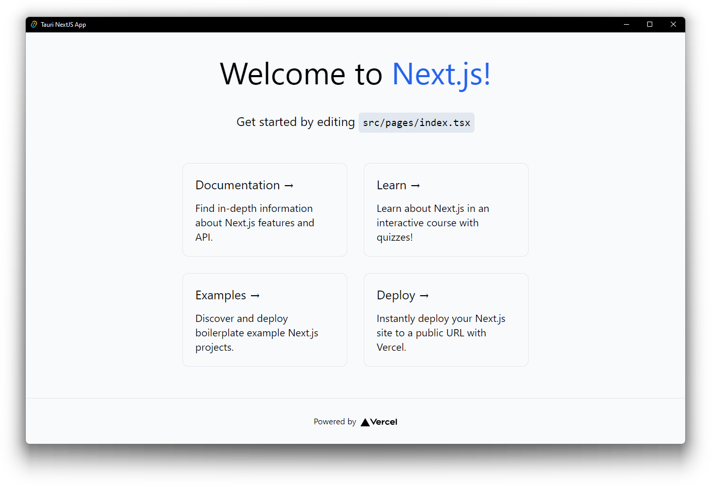

# Tauri + Next.js Template



This is a [Tauri](https://tauri.app/) project template using [Next.js](https://nextjs.org/),
bootstrapped by combining [`create-next-app`](https://github.com/vercel/next.js/tree/canary/packages/create-next-app)
and [`create tauri-app`](https://tauri.app/v1/guides/getting-started/setup).

This template uses [`yarn`](https://classic.yarnpkg.com/) as the Node.js dependency
manager.

## Getting Started

### Running Next.js (browser) development server:

To run a normal browser-based development server for the Next.js frontend:

```shell
yarn dev
```

This will start a local Next.js development server on `localhost:3000`

### Running development server using Tauri window:

To develop and run the frontend on a Tauri window:

```shell
yarn tauri dev
```

This will allow the Next.js frontend to be loaded into a Tauri webview window.

### Source structure

Next.js frontend source files are located in `src/` and Tauri Rust application source
files are located in `src-tauri/`. Please consult the Next.js and Tauri documentation
respectively for questions pertaining to either technology.

## Learn More

To learn more about Next.js, take a look at the following resources:

- [Next.js Documentation](https://nextjs.org/docs) - learn about Next.js features and API.
- [Learn Next.js](https://nextjs.org/learn) - an interactive Next.js tutorial.

And to learn more about Tauri, take a look at the following resources:

- [Tauri Documentation - Guides](https://tauri.app/v1/guides/) - learn about the Tauri toolkit
